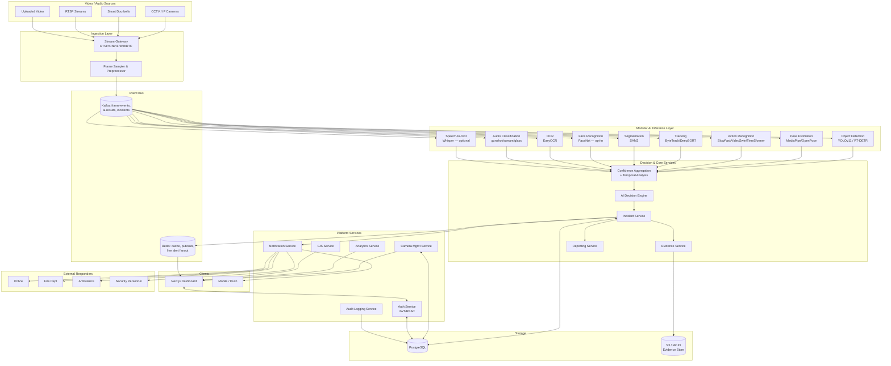
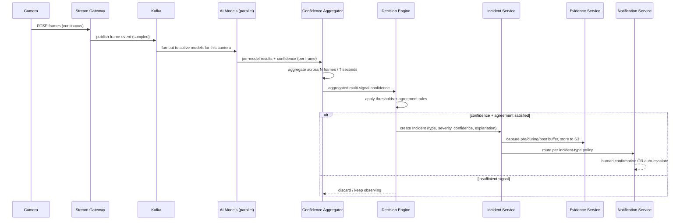
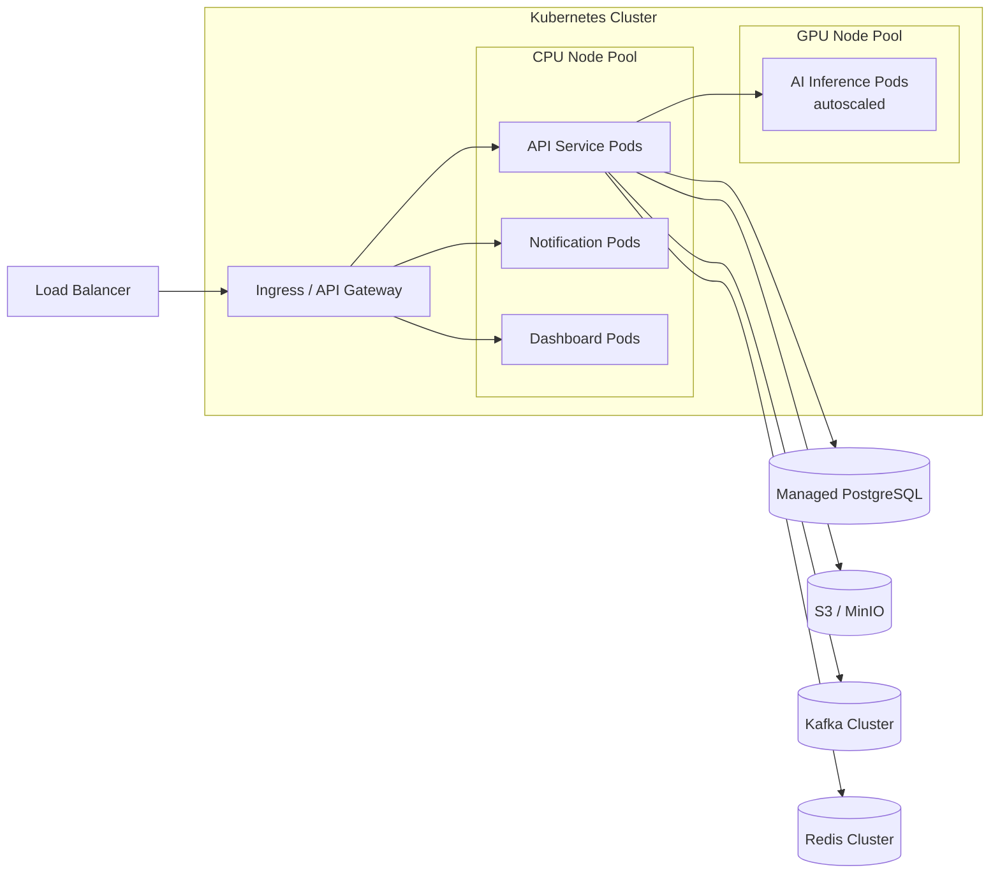

# Sentinel AI — System Architecture

## 1. Architectural Style

Microservices, event-driven where it matters (ingestion → inference → decision → notify),
synchronous REST where it's simpler (CRUD, dashboard queries). Clean Architecture / DDD
layering inside each service: `domain` → `application` → `infrastructure` → `api`.

## 2. High-Level Architecture Diagram



## 3. Data Flow Summary (single frame → incident)



## 4. Service Boundaries

| Service | Responsibility | Maps to FRs |
|---|---|---|
| Auth Service | Authentication, RBAC, session/token issuance | FR-12 |
| Camera Management Service | Camera CRUD, health, zone/site mgmt | FR-1 |
| Stream Gateway | Protocol adapters (RTSP/ONVIF/WebRTC), frame sampling | FR-1 |
| AI Inference Services (one per model family) | Independently deployable model servers behind a common gRPC/REST contract | FR-2 |
| Confidence Aggregator | Temporal + multi-model fusion | FR-2.6 |
| AI Decision Engine | Threshold/agreement rules → incident creation | FR-3 |
| Incident Service | Incident lifecycle, state machine (open→confirmed→escalated→resolved/dismissed) | FR-3 |
| Evidence Service | Buffered clip capture, chain-of-custody storage | FR-4 |
| Reporting Service | PDF report generation | FR-5 |
| Notification Service | Multi-channel routing + delivery tracking | FR-6 |
| Analytics Service | Aggregated stats, dashboards | FR-7.6 |
| GIS Service | Map data, nearest-responder lookup, routing | FR-8 |
| Audit Service | Immutable audit trail of privileged actions | NFR-3 |

## 5. Deployment Topology



## 6. Folder Structure (Monorepo)

```
sentinel-ai/
├── docs/                          # PRD, SRS, architecture, ADRs
│   ├── 01_PRD.md
│   ├── 02_SRS.md
│   ├── 03_ARCHITECTURE.md
│   ├── 04_database_schema.sql
│   └── 05_ER_diagram.md
│
├── backend/
│   ├── services/
│   │   ├── auth-service/
│   │   │   ├── app/
│   │   │   │   ├── domain/            # entities, value objects
│   │   │   │   ├── application/       # use cases / services
│   │   │   │   ├── infrastructure/    # DB repos, external clients
│   │   │   │   └── api/               # FastAPI routers, schemas
│   │   │   ├── tests/
│   │   │   ├── Dockerfile
│   │   │   └── pyproject.toml
│   │   ├── camera-service/            # same internal layout pattern
│   │   ├── incident-service/
│   │   ├── evidence-service/
│   │   ├── reporting-service/
│   │   ├── notification-service/
│   │   ├── analytics-service/
│   │   ├── gis-service/
│   │   └── audit-service/
│   ├── ai-pipeline/
│   │   ├── inference-services/
│   │   │   ├── object-detection/
│   │   │   ├── pose-estimation/
│   │   │   ├── action-recognition/
│   │   │   ├── tracking/
│   │   │   ├── segmentation/
│   │   │   ├── face-recognition/      # opt-in, feature-flagged
│   │   │   ├── ocr/
│   │   │   └── audio-classification/
│   │   ├── aggregator/                # confidence aggregation + temporal analysis
│   │   ├── decision-engine/
│   │   └── model-registry/            # versioning, ONNX/TensorRT export configs
│   ├── shared/
│   │   ├── libs/                      # shared schemas, auth middleware, logging
│   │   └── proto/                     # gRPC contracts between AI services
│   └── gateway/
│       ├── stream-gateway/            # RTSP/ONVIF/WebRTC ingestion
│       └── api-gateway/               # public REST/GraphQL entrypoint
│
├── frontend/
│   ├── apps/
│   │   └── dashboard/                 # Next.js app
│   │       ├── app/                   # App Router pages
│   │       ├── components/
│   │       ├── lib/
│   │       ├── hooks/
│   │       └── public/
│   └── packages/
│       ├── ui/                        # shared shadcn-based component library
│       └── types/                     # shared TS types (generated from OpenAPI)
│
├── infra/
│   ├── docker/
│   │   └── docker-compose.yml         # local dev stack
│   ├── kubernetes/
│   │   ├── base/
│   │   └── overlays/{dev,staging,prod}/
│   ├── terraform/                     # cloud infra as code (optional path)
│   └── ci-cd/
│       └── github-actions/
│
├── tests/
│   ├── integration/
│   └── e2e/
│
├── scripts/                           # dev tooling, seed data, migration helpers
├── .env.example
├── docker-compose.yml
└── README.md
```

## 7. Key Design Decisions (ADR summary)

| Decision | Rationale |
|---|---|
| Microservices over monolith | Independent scaling of GPU-bound AI services vs. CPU-bound API services |
| Kafka for frame/result events | Decouples ingestion rate from inference throughput; enables replay for debugging |
| Redis for live fanout | Sub-second delivery of live alerts to dashboard via pub/sub |
| No single-frame alerting | Core false-positive mitigation requirement (FR-2.6) |
| Human-confirmation default | Safety/liability requirement (PRD §9) |
| Evidence store separate from OLTP DB | S3/MinIO better suited to large binary objects; Postgres holds metadata/pointers |
| Modular AI service contracts | Each model swappable independently (NFR-5) |

## 8. Next Phases

- **Phase 2** implements Auth, Camera, Incident, Evidence, Notification services against
  the schema in `04_database_schema.sql`.
- **Phase 3** implements the AI inference services and Decision Engine per the contracts
  defined here.
- **Phase 4** implements the Next.js dashboard consuming the Phase 2 APIs.
- **Phase 5** delivers Docker Compose (local), Kubernetes manifests, and CI/CD.
