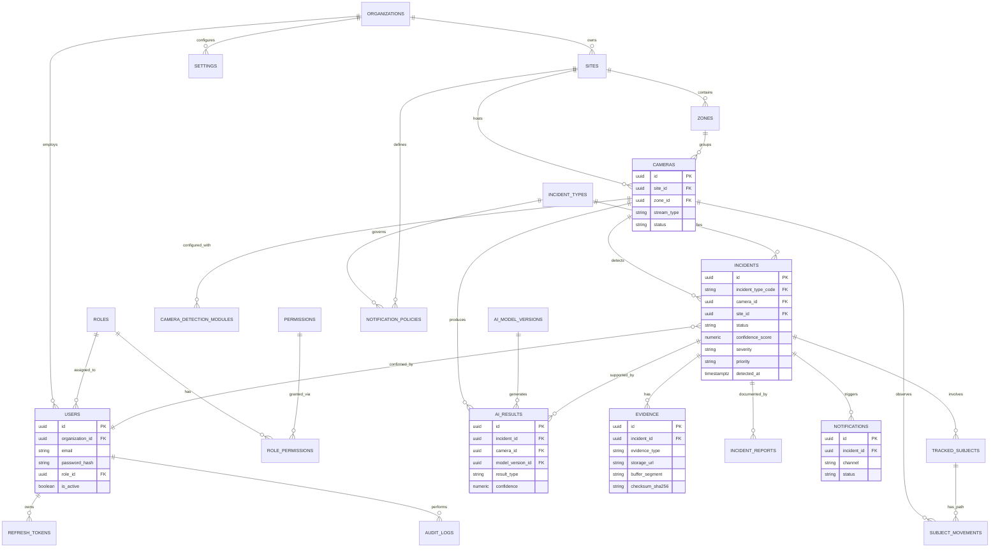

# Sentinel AI — Entity Relationship Diagram

Corresponds to `04_database_schema.sql`.

## Notes

- `incidents.status` state machine: `open → confirmed → escalated → resolved` or
  `open → dismissed/false_positive`.
- `evidence.checksum_sha256` supports chain-of-custody integrity verification.
- `camera_detection_modules` allows per-camera enable/disable of each AI model family
  without schema changes when new modules are added (module_code is a free-form string
  keyed against the AI service registry, not a hard FK — kept intentionally loose so new
  detection modules in Phase 3 don't require a migration).
